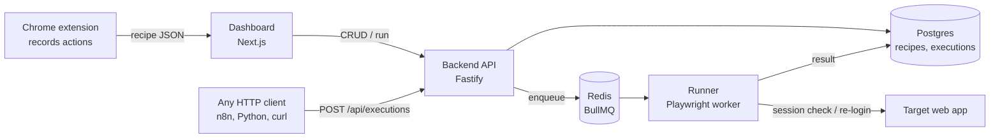

# rpa-engine

A self-hosted browser automation service. You record a flow in Chrome, tune it in a visual editor, and call it through an HTTP API. A Playwright worker runs it and returns the extracted data or the downloaded file.

I built it to pull reports from web portals that have no API, for a logistics data pipeline ([logistics-sync](https://github.com/leopp18/logistics-sync)). It also replaced a set of hand-written scrapers with recipes that can be edited without redeploying code.

> **Note:** sanitized copy of a project I built and ran at work. Real recipes, target sites, credentials and deployment details are not included. Some UI text is in Portuguese.

## How it works



1. **Record:** the extension captures clicks, inputs, selects and downloads, builds CSS selectors, and exports a *recipe*: a JSON list of steps plus declared inputs.
2. **Edit:** the dashboard has a step-by-step recipe editor. Credentials go into encrypted *secrets* and are referenced as `{{secrets.password}}`. Runtime values are `{{inputs.date}}`.
3. **Run:** `POST /api/executions` enqueues a job. The runner picks it up, reuses an open browser if the session is still valid, runs the login steps only when it isn't, executes the recipe and stores the result.
4. **Consume:** the caller either waits for the result (sync mode, up to 300 s, with a `408` + execution id to poll if it takes longer) or fires and forgets (`/api/executions/async`). With `?format=file&key=<name>` the API returns a downloaded file as binary.

## Features

- **Recipes as data:** Zod-validated steps shared by every package (`navigate`, `click`, `hover`, `fill`, `select`, `wait`, `extract`, `screenshot`, `download`, `upload`, `pbi_export`)
- **Session reuse:** a configurable check (CSS selector or JS expression) decides whether to re-run the login steps, so most jobs skip login entirely
- **Encrypted secrets:** AES-256-GCM in the database, never returned by the API or written to logs
- **Key stays server-side:** the dashboard talks to the API through an authenticated Next.js proxy route, so the API key never reaches the browser
- **Queue-based execution:** BullMQ on Redis, with executions and their results kept in Postgres
- **Dashboard:** login, recipe editor with JSON import/export, execution history with Excel export, and a page that builds the API call for a recipe
- **Deploy:** Dockerfiles per service plus a production compose file behind Caddy (automatic HTTPS)

## Example

```bash
curl -X POST "http://localhost:3000/api/executions?timeout=120" \
  -H "X-API-Key: $API_KEY" \
  -H "Content-Type: application/json" \
  -d '{"recipe_id": "<uuid>", "inputs": {"startDate": "01/04/2026"}}'
```

A recipe, shortened:

```json
{
  "name": "Delivery report",
  "inputs": [{ "name": "startDate", "required": true }],
  "session": {
    "check": { "selector": "#user-menu" },
    "login_steps": [
      { "type": "navigate", "url": "https://portal.example.com/login" },
      { "type": "fill", "selector": "#user", "value": "{{secrets.user}}" },
      { "type": "fill", "selector": "#password", "value": "{{secrets.password}}" },
      { "type": "click", "selector": "button[type=submit]" }
    ]
  },
  "steps": [
    { "type": "navigate", "url": "https://portal.example.com/reports" },
    { "type": "fill", "selector": "#start", "value": "{{inputs.startDate}}" },
    { "type": "download", "selector": "#export-csv", "name": "report" }
  ]
}
```

## Tech stack

TypeScript · Node.js 20 · Fastify · BullMQ · Redis · PostgreSQL · Playwright · Zod · Next.js · Tailwind · Chrome Extension (Manifest V3) · Docker · Caddy · pnpm workspaces

## Repository layout

```
packages/
  types/       shared Zod schemas (recipe, step, session, execution, DTOs)
  backend/     Fastify API, BullMQ producer, AES-256-GCM secrets
  runner/      BullMQ worker, Playwright step executor, session manager
  dashboard/   Next.js UI
  extension/   Chrome recorder (MV3), built with esbuild
infra/init.sql database schema
docs/          architecture notes (Portuguese) and roadmap
```

